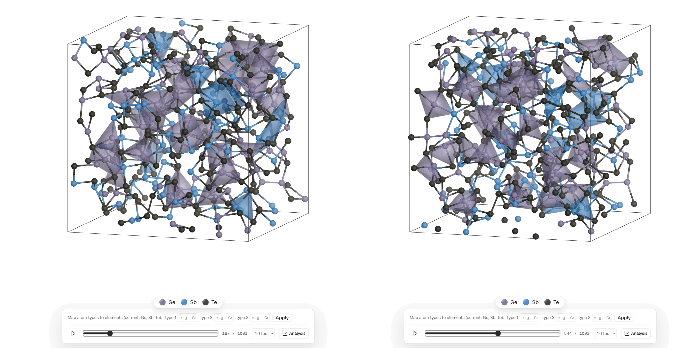
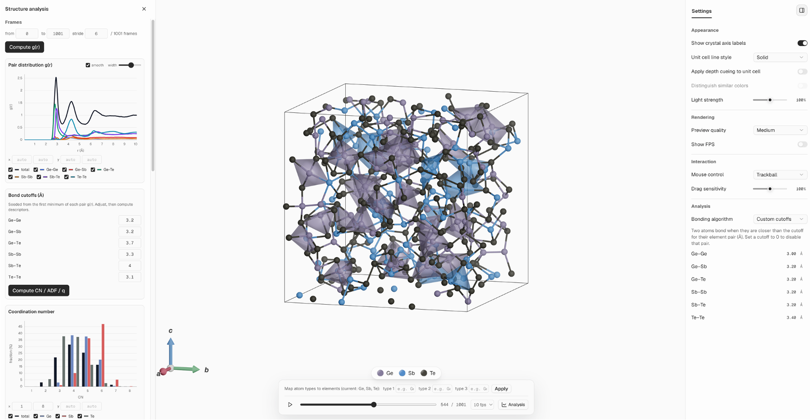
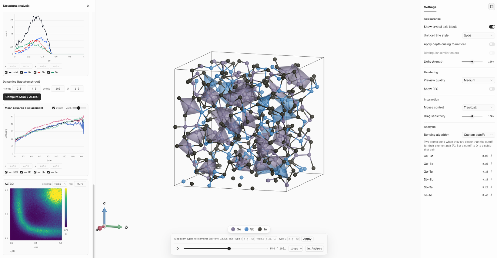

<h1 align="center">Pretty Lattice</h1>

<p align="center">
  Pretty Lattice 是一个晶体结构可视化工具，用来快速做出美观、适合发表的结构图。
</p>
<p align="center">
  <a href="https://github.com/songfeitong/pretty-lattice/actions/workflows/ci.yml"></a>
  <a href="https://pypi.org/project/pretty-lattice/"></a>
  
  
</p>


<p align="center">
  <a href="README.md">English</a> | 简体中文
</p>

> 本项目是原项目 [pretty-lattice](https://github.com/songfeitong/pretty-lattice)
> (作者 [@songfeitong](https://github.com/songfeitong))的扩展 fork。晶体**可视化**核心来自上游项目;
> 本 fork 增加了**轨迹可视化**与**结构分析**。详见[致谢](#致谢)。

- **美观**：内置更现代美观的颜色、材质、光照和景深效果
- **易用**：在浏览器里加载、预览和导出结构，直观易用的用户界面
- **可靠**：结构文件读取和分析基于成熟的 [pymatgen](https://github.com/materialsproject/pymatgen)
- **可扩展**：上万原子的结构也能流畅交互
- **灵活**：颜色、半径、材质、透明度、视角和导出参数都可以按需要修改

<p align="center">
  
</p>


## 为什么做 Pretty Lattice

我一直觉得想画出一张好看的晶体结构图很难。

传统的晶体学工具（比如 VESTA）功能确实强大，但默认的视觉效果总让人觉得过时。辣眼睛的配色、粗糙的3D效果，往往得花大量时间手动调整，画面才算勉强能看。当然，另一种选择是把结构导入像 Cinema 4D 或 Blender 这类专业 3D 软件里渲染，可那样又显得大炮打蚊子，而且学习曲线要陡峭得多。

Pretty Lattice 就是我为弥补二者之间的空白空缺所做的尝试。它基于 Three.js 构建，在相对轻量的同时保证高质量的画面。它提供了一个现代直观的用户界面，以及研究者熟悉的操作方式，开箱即用，直出干净又美观的晶体图。

> [!NOTE]
> 从设计的初衷开始，Pretty Lattice 就专注于**可视化**。它并不打算取代 VESTA、Materials Studio 这类成熟的材料分析工具，也不打算提供复杂的结构编辑或分析流程。打开的结构文件会被当作只读文件来处理。更推荐的工作方式是先用更专业的工具准备和分析结构，再把最终结构导入 Pretty Lattice 里查看、调整样式并导出图片。

## 安装

```shell
pip install pretty-lattice
```

也可以用 [uv](https://github.com/astral-sh/uv) 作为独立工具安装：

```shell
uv tool install pretty-lattice
```

运行环境：

- Python 3.12+
- macOS、Linux 或 Windows
- 任意现代浏览器

## 快速开始

安装后，启动本地图形界面：

```shell
prl gui
```

Pretty Lattice 会启动一个本地服务，并自动打开浏览器。

也可以不安装，临时运行：

```shell
uvx --from pretty-lattice prl gui
```

常用启动选项：

```shell
prl gui --no-open     # 只启动服务，不自动打开浏览器
prl gui -p 0          # 自动选择可用端口
```

## 示例

### 材质预设

<p align="center">
  
</p>

### 配色预设

<p align="center">
  
</p>

### 轨迹可视化

读取 VASP `XDATCAR`、LAMMPS `.dump` 或 `.xyz` 轨迹，用内置播放器逐帧查看。对于只带原子类型
的 dump 文件，可以随时把类型映射到真实元素，每一帧都复用相同的渲染与成键设置。

<p align="center">
  
</p>

### 结构分析

在指定帧范围上计算结构与动力学描述符，并用交互式图表查看：对分布函数 g(r)、配位数、键角分布、
序参数、均方位移（总体与分元素）以及 ALTBC。成键 cutoff 会自动取每条 g(r) 的第一个极小值作为
初值，可在计算配位数相关量之前手动调整。

<p align="center">
  
</p>

<p align="center">
  
</p>

## 致谢

本项目的晶体**可视化**基础——Three.js/React 渲染、材质、配色、相机与取向控制、元素图例、图像导出——
来自原项目 [pretty-lattice](https://github.com/songfeitong/pretty-lattice)
(作者 [@songfeitong](https://github.com/songfeitong),MIT License 发布),这部分工作的功劳归原作者。

本 fork 在其基础上增加了:

- **轨迹可视化**——读取 VASP `XDATCAR`、LAMMPS `.dump`、`.xyz` 轨迹并逐帧播放,复用相同的渲染与统一成键设置。
- **结构分析**——对分布函数 g(r)、配位数、键角分布、序参数、MSD、ALTBC,并提供交互式图表。
- **自定义元素对成键 cutoff**,以及周期性边界跨 cell 成键的修复。

## 许可证

Pretty Lattice 使用 [MIT License](LICENSE) 发布(继承自上游项目)。
